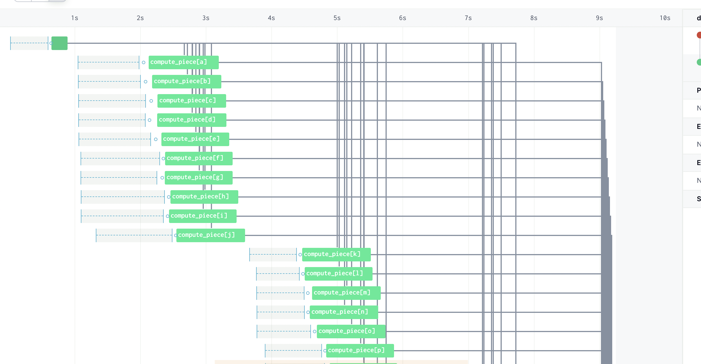
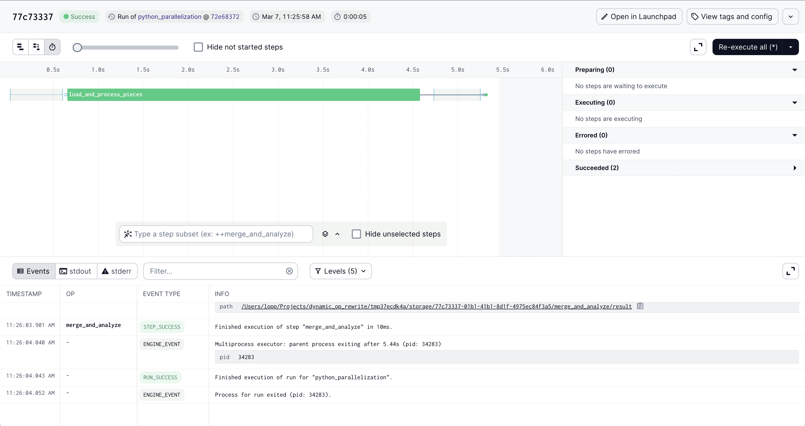

# Dagster Dynamic Outs vs Python Parallelism 

Dagster provides a way to dynamically generate a graph of operations. These dynamic graphs are one way to achieve parallel processing. An alternative is to use Python parallel processing inside of a regular graph.

This repo shows two examples:

## Dynamic Outputs in Dagster 

First create a python environment with dagster, eg `pip install -r requirements.txt`. 

Then run: 

```
dagster dev -f definitions_dynamicout.py
```

If you navigate to the Jobs pane and launch a run, you will see this result: 

. 

The *pros* to this approach are:

- Dagster provides visibility into the parallel processing at each step
- You can have Dagster handle automatic op retries for each parallel step 

The *cons* to this approach: 
- This approach is slower because each step has to spin up Dagster machinery 
- This approach can produce an overwhelming amount of metadata 
- In Dagster Cloud, each step consumes a credit (to reflect the granular obseravability Dagster is tracking / providing)

## Parallelism with Regular Python 

First create a python environment with dagster, eg `pip install -r requirements.txt`. 

Then run: 

```
dagster dev -f definitions_parallel.py
```

If you navigate to the Jobs pane and launch a run, you will see this result: 

. 

The *pros* to this approach are:

- Full flexibility over the parallel processing using standard Python machinery
- This approach is faster than the Dagster approach
- This approach uses 1 Dagster credit for the entire "map reduce" operation

The *cons* to this approach: 
- Less visibility 
- Sub-process logging, failure, and re-try must be manually implemented in Python

## What to pick 

You can see the code for both approaches is remarkably similar. I recommend using Dynamic Outputs if each "step" is expensive and worth re-attempting on its own. For example, if the step itself takes 5+ minutes to run, than the downside of increased start-up cost is minimal and the additional overhead of tracking the step in Dagster might make sense. If each step only takes a few seconds to run, the Dagster machinery is not worth invoking.

Finally, it is worth noting the two approaches can also be combined (using parallel code with the op). It is also worth mentioning *dynamic outputs in Dagster* are compatible with asset-driven pipelines as well, see this [example](https://github.com/dagster-io/hooli-data-eng-pipelines/blob/master/hooli_batch_enrichment/dagster_batch_enrichment/assets.py).